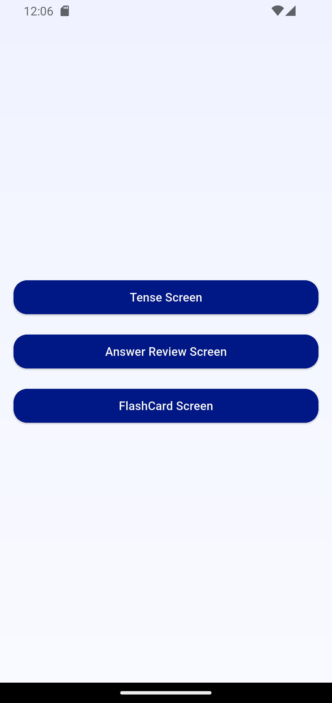
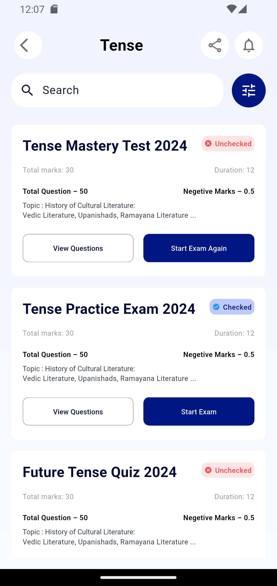
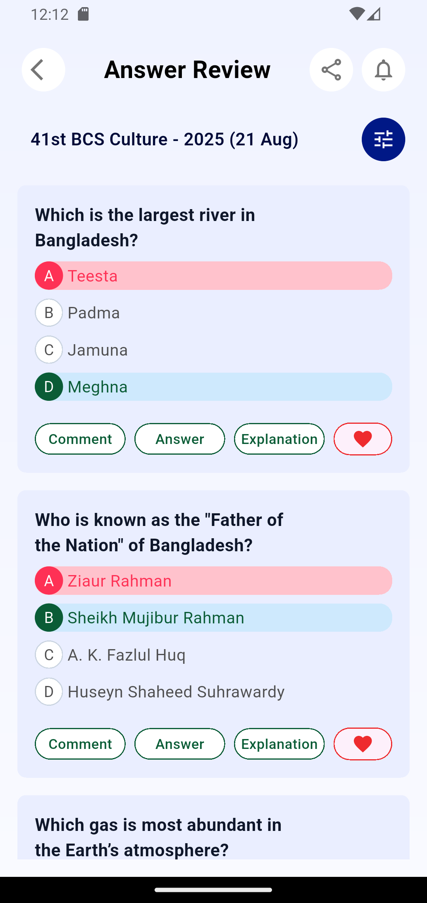
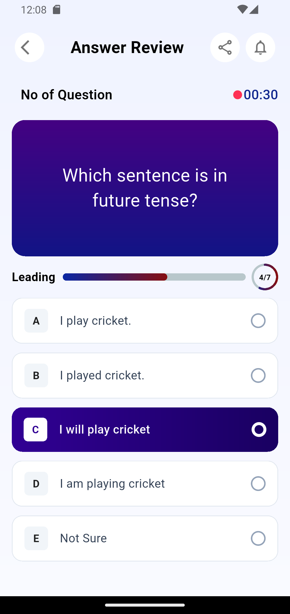

# Flutter UI Task for wiztec

This repository contains the completed codebase for the Flutter Developer Assessment Task. The project implements a clean feature-first architecture, complex UI translation from designs, and a reactive state management layer using BLoC.

---

##  Completed Task Screens

All required layout modules have been pixel-perfectly converted into Flutter widgets. The screenshots are located under the root `app_screenshots/` directory:

| 1. Home Dashboard | 2. Tense (Exam List) |
| :---: | :---: |
|  |  |
| **3. Answer Review** | **4. Flashcard Module** |
|  |  |

---

## Implemented Assessment Modules

### 1. Centralized Navigation Hub (`HomeScreen`)
* Acts as the main entry point for the evaluator to review all modules.
* Implements unified linear backgrounds matching the application design system.

### 2. Tense Exam List (`TenseScreen`)
* Integrated with `TenseBloc` to trigger and successfully load data via `TenseInitialEvent`.
* Developed a dynamic search layout structure and responsive listing using `BlocBuilder` and `ListView.builder`.

### 3. Answer Analytics (`AnswerReview`)
* Processes data dynamically via `AnswerReviewBloc`.
* Employs custom list states to map correct vs wrong user-selected choice cards dynamically.

### 4. Interactive Flashcards (`FlashCard`)
* Implements dynamic state updating (`setState`) for interactive option tracking.
* Integrates specialized horizontal progress bars and circular completion metrics utilizing the `percent_indicator` package.

---

##  Architecture & Core Dependencies

The assessment follows a structured, modular, and maintainable **Feature-First Architecture**:

* **State Management:** `flutter_bloc` (Event-driven data streams).
* **Metrics Visualization:** `percent_indicator` package for handling multi-type progress bars.

```text
lib/
├── app/
│   └── app_colors.dart                 
├── features/
│   ├── common/widgets/                
│   ├── tense/                          
│   ├── answerreview/                   
│   └── flashcard/                      